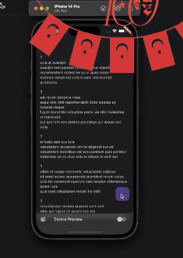
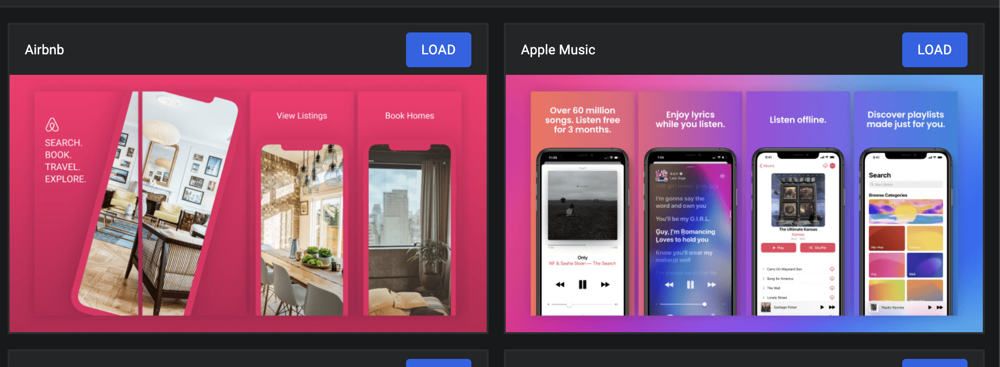

Flutter Architecture Template - II
Many years ago, I created an end-to-end application development template using Flutter. Currently, I'm publishing new series with better ideas and new implementations. Let's learn together!
The purpose of this article is to help you understand how to build a custom business application. The enterprise or large project has an important point to consider. I can actually discuss this topic in more detail, but for now I'd like to build this architecture from zero to hero. Come on, let's do this!
Architecture template..
Yes, that's my main goal. Actually, I have two goals, the first is to advance my coding skills (more structural); the second is to create a template. Architecture coding provides a better coding environment, a solution, testing, modularization, etc. Additionally, template will encourage team collaboration, differentiation, and many more things.
That sounds good, right?
-Yes, but don't forget that this is not suitable for only one person or side project. Teamwork is better for understanding and implementing this.
How many component is in this article
In this project, core ideas have been created for an advanced mobile project. The following are included:
e1: Create project, module with structure of folders 
e2: Development of modules by modules
In terms of networking (Vexana)
Hive caching (Isaar version)
Managing dependencies (get_it)
Management of the state (Flutter BLoC)
Using better pubspec yaml with 3.party package
A list of useful scripts
Extensions, rules, etc., for VSCode.
Creating a page structure
The navigation

Let's start this survey for begining great architecture.

# 1.Create Project with Structure Folders

The main idea while developing architecture, this is first point. Because it is provide to where to write coding. This think will help to organize code base in the project. Organization will adapt to your new developer to project, keep the reletaed file same folder and you knew when coming new feature request to put it in your project.my
Reasons can be going more but the think quite important. Then what is my solution? 
The solution based on moduler thinks with feature base development. It is sepearte most important logic for ex. databasse/ network etc.
// Project Structure
lib/
├── development/
│ └── preview_main.dart
├── feature/home/
│ ├── view/
│ └── view_model/
└── product/
├── cache/
├── init/
├── navigation/
├── service/
├── state/
├── utility/constans/
└── widget/
└── main.dart

module/
├── common/
├── core/
├── gen/
└── widgets/
Thisi structure will provide your every request or you can find a uprade chance. There is reason of good strcutre. you can always add extra solution.

# 2. Vscode extensions with Pubspec Details

For this architecture, I use many extensions for helping coding, debugging and fast developing. The other hand I configure my vscode settings for coding better.
Last part is snippet. I create many snippet for speed up coding. For example I create "hwaFsm" it is mean "HardwareAndro Flutter statefull Model.

It is example of "base model" snippet.

    "Base Model ": {
    	"scope": "dart",
    	"prefix": "hwaBaseModel",
    	"body": [
    		"import 'package:json_annotation/json_annotation.dart';",
    		"part '$1.g.dart';",
    		"",
    		"@JsonSerializable()",
    		"class $2 extends INetworkModel<$2> {",
    		"@override",
    		"$2 fromJson(Map<String, dynamic> json) {",
    		"return _$$2FromJson(json);",
    		"}",
    		"@override",
    		"Map<String, dynamic> toJson() {",
    		"return _$$2ToJson(this);",
    		"}",
    		"}",
    	]
    },

After the writing key word "hwaBaseModel" and tab it will create a base model. It is very useful for me. You can create your own snippet for your needs.
The other hand about pubspec.yaml. While develoing project you need to add many package. This time the important thing is "annotation" and build operation.
Annotation is very helpfull for finding package for why I use this package.

For example:
#firebase
firebase_messaging: 4.5.0
firebase_core: 3.1.0
PR: https://github.com/VB10/architecture_template_v2/pull/4

# 3. Localization support

The localization is very important for mobile application the latest year. Almost all application has localization. So I want to show you how to add localization in this project.
It will making from localization manager for language feature. The other hand is generate key for localization. I'm using "easy_localization" package for this case. I have been using this package for a long time and it is very stable.

Let's see the example of localization implementation. First part of is define your key with value in the json. The important thing is the key. You can use argument for dynamic value.
For example: You want to show "Save 10000" in the button. You can use {count} for dynamic value.

{
"home": {
"title": "Home Page"
},
"general": {
"button": {
"save": "Save {}"
}
}
}

The other part is localization manager. You can see the example of localization manager.
final class ProductLocalization extends EasyLocalization {
/// ProductLocalization need to [child] for a wrap locale item
ProductLocalization({
required super.child,
super.key,
}) : super(
supportedLocales: \_supportedItems,
path: \_translationPath,
useOnlyLangCode: true,
);

static final List<Locale> \_supportedItems = [
Locales.tr.locale,
Locales.en.locale,
];

static const String \_translationPath = 'asset/translations';

/// Change project language by using [Locales]
static Future<void> updateLanguage({
required BuildContext context,
required Locales value,
}) =>
context.setLocale(value.locale);
}

This class will help to define your language support and change language in the app. Before the using this class don't forget to add a asset/translations folder and json file.
assets: - asset/translations/

Lastly it's need to work build runner for generate a code. (I'll explaing code generation in the next section)
Finally localization is ready to use. Just call with LocaleKeys;

example:
Text(LocaleKeys.home_title.tr());

Easy Localization Package: https://pub.dev/packages/easy_localization
PR: https://github.com/VB10/architecture_template_v2/pull/2

# 4. Project requirements while app staring and Environment management

The application start with requirements. Many things can be checked before running the application. For example, internet permission, camera permission, database connection, etc.
I want to show you how to manage this situation.

Environment management is very important for mobile application. It has many values for example change base url, api key, etc. The thing is how to keep this in project.
Envied package is very useful for this case. it helps to manage environment variable with obfuscate. It is not mean very secure but it is very useful for this case.

Let's check the implemntation when application start.

/// This method is used to initialize the application process
Future<void> \_initialize() async {
await EasyLocalization.ensureInitialized();
EasyLocalization.logger.enableLevels = [LevelMessages.error];
await SystemChrome.setPreferredOrientations([DeviceOrientation.portraitUp]);
// TODO: Splash
await DeviceUtility.instance.initPackageInfo();

    FlutterError.onError = (details) {
      /// crashlytics log insert here
      /// custom service or custom logger insert here
      /// Todo: add custom logger
      Logger().e(details.exceptionAsString());
    };

    AppEnvironment.general();
    // Depedency initialize
    // envied

}

It is general request for project. Error handling is helping to find a see a error. system chrome is for device orientation. Easy localization is for localization.
Device utility is for device information. App environment is for environment management. These are basicly required for project. Main idea is when you need to add a new requirement for project you can add this.

Important point is you need to use any implmentatiion initiilaze in splash screen. There is very good opinion for this. Every code is getting extra time while app starting. Splash page very good idea for this.

Envied Package: https://pub.dev/packages/envied
< Don't forget to add envied generator for making a code from .env file >

Let's implement this package in this project.
1- Create a new .env file then add this file to .gitignore
2- Add your base url, api key, etc.
3- Create a new file as a dev_env.dart for storing a environment variable.
4- Declare your envied path for top of class name and add your veriable like "static const baseUrl = \_DevEnv.baseUrl;"
5- Run builder for generating a code from .env file.

For example:
My envied file is look like this.

```json
BASE_URL=https://api.sample.com
```

The other hand is dev_env.dart file.

```dart
import 'package:envied/envied.dart';

part 'dev_env.g.dart';

@Envied(path: '.env')
class DevEnv {
  @EnviedField(varName: 'BASE_URL')
  static const baseUrl = _DevEnv.baseUrl;
}
```

That's it. You can use your env variable now with secure for all your variables.
Don't forget you will learn to code generation for best usage for next section so you can find a right code from this.
I complelty made general code gen in other sub module.

# 5. Theme & Code Generation

#Code generation
In my opinion code generation is most important thing for project. It is help to make a code easier, more readable and acssable. It is very useful for project. I'm usign many package for code genration layer. Asset gen help to make a asset easier. For example image,lottie, json, font, etc. Envied gen is for environment management with secure. Within this article manage this code genration alyer from new module. It is very easy to implement and manage.

The new module name is "gen" and it is very easy to implement and manage.
This folder has contain 4 sub module.

1- Asset Gen
2- Envied Gen
3- Model Generation

1- Asset Gen
Asset generation will using lottie, svg, font, image etc. It works by using flutter_gen package. This package is very easy to use and it is very powerful. The package needs to declare in the pubspec.yaml file.

```yaml
flutter_gen:
  output: lib/src/asset/
  integrations:
    lottie: true
    flutter_svg: true

  colors:
    inputs:
      - assets/color/colors.xml
```

After that you need to run build runner for generating a code.

```bash
flutter pub run build_runner build
```

The results are look like this.

```dart
Assets.color.black
Assets.images.imageName
Assets.lottie.animZombie
```

2- Envied Gen
Envied gen is for environment management with secure. The previous section is for this. You can find a detail for this. I just move to this module.

3- Model Generation
Model generation is for model. It is very useful for model. I'm using json_serializable package for this case. This package is very easy to use and it is very powerful. The package needs to declare in the pubspec.yaml file.

```yaml
dev_dependencies:
  json_serializable: ^6.7.1
```

Book.dart

```dart
@JsonSerializable()
@immutable
final class Book with EquatableMixin {
  const Book({
    this.type,
    this.id,
    this.attributes
  });
  factory Book.fromJson(Map<String, dynamic> json) => _$BookFromJson(json);

  final String? type;
  final String? id;
  final Attributes? attributes;
}
```

That's it. You can use your model now with json_serializable.

2- Theme
Theme most important thing for this article. I'll create theme with "Theme Manager" and it is very easy to use. This is help to make a theme to light and dark. You can use
theme builder from material. Also text theme class for helping text theme for text theme. I was create a good article about this. You can check it. Theme main idea is
"how to make a color etc from mainly" and "how to implement new theme with easy".

vb10 theme medium

The theme structure has a main idea coming from abstract layer as a CustomTheme. It helps to make a multiple scheme like light and dark.

```dart
/// Custom theme for project design
abstract class CustomTheme {
  ThemeData get themeData;

  FloatingActionButtonThemeData get floatingActionButtonThemeData;
}
```

After that you can implement your theme like this.

```dart
/// Custom light theme for project design
final class CustomLightTheme implements CustomTheme {
  @override
  ThemeData get themeData => ThemeData(
        useMaterial3: true,
        fontFamily: GoogleFonts.roboto().fontFamily,
        colorScheme: CustomColorScheme.lightColorScheme,
        floatingActionButtonTheme: floatingActionButtonThemeData,
      );

  @override
  FloatingActionButtonThemeData get floatingActionButtonThemeData =>
      const FloatingActionButtonThemeData();
}

```

This file for helping to make a theme basicly in font family, colorScheme etc. The other hand you can make a custom theme like FloatingActionButtonThemeData as a custom. It's need to call from MaterialApp inside.

```dart
  Widget build(BuildContext context) {
    return MaterialApp.router(
      routerConfig: _appRouter.config(),
      builder: CustomResponsive.build,
      theme: CustomLightTheme().themeData,
      darkTheme: CustomDarkTheme().themeData,
      themeMode: context.watch<ProductViewModel>().state.themeMode,
      localizationsDelegates: context.localizationDelegates,
      supportedLocales: context.supportedLocales,
      locale: context.locale,
    );
  }
```

For example you can need to use a color from colorScheme just call like this.

```dart
context.general.colorScheme.primary (this estension coming from kartal package)
```

# 6. Navigation structure, Scripts for helping development, 3.party package best usage

### Scripts for helping development
While developing like this bigger project, I need to make a script for helping development. I'll show you how to make a script for helping development. These scripts are very useful for development.

- android_build.sh => It will make apk or app bundle
- build.sh => It's run build runner
- clean.sh => It's clean your main project (flutter, ios clean)
- full_clean.sh => It's clean your project with sub modules
- icon_build.sh => It's make a icon for android and ios
- ios_clean.sh => It's clean a ios build and pod file
- lang.sh => It's generate a localization code (call easy_localization:generate)

Of course you can add more script for your needs but these scripts generally help to development. After my video I'm starting to use two new solution for script using

- rps package for create script in pubspec yaml then call with rps command (https://pub.dev/packages/rps)
- Command List extension for vscode for sum of script (https://marketplace.visualstudio.com/items?itemName=yamajyn.commandlist)

### Navigation structure

The main idea is navigation. It is very important for mobile application. I'll show you how to make a navigation structure. I'm using go_router package for this case. This package is very easy to use and it is very powerful. Especially manage a route with auto generate it is useful. Auto router package has a lot of navıgatıon feature in deeply. Let's implement this package in this project.

The app router file help to create a route with auto generate. How many page you have, you can add this flow.

```dart

@AutoRouterConfig(replaceInRouteName: AppRouter._replaceRouteName)

/// Project router information class
final class AppRouter extends RootStackRouter {
  static const _replaceRouteName = 'View,Route';
  @override
  List<AutoRoute> get routes => [
        AutoRoute(page: HomeRoute.page, initial: true),
        AutoRoute(page: HomeDetailRoute.page),
      ];
}

```

After that you need to wrap your project with AppRouter. It is need to call MaterialApp.router then pass to your config.

```dart
final class _MyApp extends StatelessWidget {
  const _MyApp();
  static final _appRouter = AppRouter();
  @override
  Widget build(BuildContext context) {
    return MaterialApp.router(
      routerConfig: _appRouter.config(),
    );
  }
}
```

It is almost done. After this implementation you can use like this. Also you have many feature for navigation like push, pop, replace, etc with context.router usage.

```dart
 context.router.push(HomeDetailRoute(id: user.userId.toString()));
```

> Auto router works only view file so the build yaml file can be update for work effectively.

```yaml
targets:
  $default:
    builders:
      auto_route_generator:auto_route_generator: # this for @RoutePage
        generate_for:
          - lib/**/**_view.dart
      auto_route_generator:auto_router_generator: # this for @AutoRouterConfig
        generate_for:
          - lib/product/navigation/app_router.dart
```

### 3.party package best usage

Third party package most of the time used many project. It is very important to use this package for the future. I'll show you how to use this package for best usage. I have been using Cached network image pakcage until now. It is very useful for image loading. Let's make a example for this package.

Before install this package you need to add a dependency in pubspec.yaml file.

```yaml
cached_network_image: ^latest_version
```

After I'm going to create a new module as a common. It will help to use this package in the project. My idea is create new widget for using this package. The new widget does need's to any package configuration.
It just depend my primitive class. That's so important because it can be change everytime or improve without any extra problem for my main project. Main project just know my new widget does not read or reach my cached network image.

```dart
/// It will provide to image caching and image loading from network
final class CustomNetworkImage extends StatelessWidget {
  /// The line `const CustomNetworkImage({super.key});` is defining a constructor
  /// for the `CustomNetworkImage` class.
  const CustomNetworkImage({
    super.key,
    this.imageUrl,
    this.emptyWidget,
    this.memCache = const CustomMemCache(height: 200, width: 200),
    this.boxFit = BoxFit.cover,
    this.loadingWidget,
    this.size,
  });
}

```

This one is very simple. It is not need any package configuration. It is just depend my primitive class. MemCache is for memory cache using for core package. This widget can use everywhere in the project with paramters and does not need any extra configuration.

> Main idea is this coding: Does not give a any package source code the anyone. It is only depend my primitive class. It will help to improve or change in the future for easily.

# 7. Kartal package, Responsive design, Custom widget design

The kartal package developing my hand. It is helping to coding with extensions. Package contains many extension with primitive type or advanced type. It is very useful for coding.
For examples:

```dart
context.general.colorScheme.primary
context.sized.low (0.1 percent of screen size)
GlobalKey.rendererBox
List.ext.nullOrEmpty
''.ext.launchUrl
```

And more. You can check out my pub.dev page for more detail. https://pub.dev/packages/kartal


### Responsive design

After flutter growing up mobile, tablet with web. Responsive design pretty important for project. I'm using Responsive package for this case. This package is very easy to use and it is very powerful. The package needs to declare in the pubspec.yaml file.

```yaml
responsive_framework: ^latest_version
```

The package very useful for responsive design. It has many breakpoint for responsive design. You can check out the detail from pub.dev page. https://pub.dev/packages/responsive_framework
I was creating a custom responsive class for managing responsive design breakpoint.

```dart
final class CustomResponsive {
  /// Make to ui responsive
  static Widget build(BuildContext context, Widget? child) {
    return ResponsiveBreakpoints.builder(
      child: child!,
      breakpoints: [
        const Breakpoint(start: 0, end: 450, name: MOBILE),
        const Breakpoint(start: 451, end: 800, name: TABLET),
        const Breakpoint(start: 801, end: 1920, name: DESKTOP),
        const Breakpoint(start: 1921, end: double.infinity, name: '4K'),
      ],
    );
  }
}

```

You can declare your breakpoint in this class. After your implementation your project can be responsive very easily. You just make your poject single design for example Iphone 14 then you don't need to care about other screen size. It will working a responsive for all screen size.

Also you can check this website for more detail. https://gallery.codelessly.com/flutterwebsites/minimal/

### Custom widget design

Probably you will many times create a new widget. While making a widget you don't forget to basic, usefull and expandable.So this time I'm going to show you how to make a dialog component. My dialog is success_dialog. It very basic widget for showing a success message.

```dart
final class SuccessDialog extends StatelessWidget {
  /// Constructor for dialog
  const SuccessDialog({required this.title, super.key});

  /// Title for the dialog
  final String title;


  @override
  Widget build(BuildContext context) {
    return AlertDialog.adaptive(
      title: Text(title),
      actions: [
        IconButton(
          onPressed: () {
            Navigator.of(context).pop(true);
          },
          icon: const Icon(Icons.check),
        ),
      ],
    );
  }
}
```

That's basic widget for version of one. If i want to show this diaog, i've to call "ShowDialog" code everywhere. It's not good for using, quality and maintainability. I'm going to add a new function as a show function.

```dart

  /// Show the dialog for success
  /// This will always return [true]
  static Future<bool> show({
    required String title,
    required BuildContext context,
  }) async {
    await DialogBase.show<bool>(
      context: context,
      builder: (context) => SuccessDialog(title: title),
    );
    return true;
  }
```

My team can be know how to use this alert very easily. It just call "SuccessDialog.show" function.

> Little hint when you close your widget i mean add a private constructor, anyone can't call your widget directly.

# 8. Stateless widget, Stateful widget and Mixin Usage

The topic is related to every flutter project. It is valuable for understanding the your coding life. Let's check out of example for usage. Actually i did not tell about core concept of these widgets. I'll try to show usage of these widgets.

- First point is you can use inheritance for some widget. Most of usage is padding. It is using probably in every project. My idea is making a padding widget class for making standard the project.

```dart
final class ProjectPadding extends EdgeInsets {
  const ProjectPadding._() : super.all(0);

  /// All Padding
  ///

  /// [ProjectPadding.allSmall] is 8
  const ProjectPadding.allSmall() : super.all(8);

  /// [ProjectPadding.allMedium] is 16
  const ProjectPadding.allMedium() : super.all(16);

  /// [ProjectPadding.allNormal] is 20
  const ProjectPadding.allNormal() : super.all(20);

  /// [ProjectPadding.allLarge] is 32
  const ProjectPadding.allLarge() : super.all(32);

  /// Symmetric
  /// Only left,right,bottom
}
```

This is helping to usable component for project. You don't need to add extra stateless widget for padding. You can use this class for padding.

- The other example is stateless widget. I'm creating a widget as a NormalButton. It is simple button with border radius.

```dart
/// radius is 20
final class NormalButton extends StatelessWidget {
  const NormalButton({required this.title, required this.onPressed, super.key});

  /// title text
  final String title;

  /// button on pressed
  final VoidCallback onPressed;

  @override
  Widget build(BuildContext context) {
    return InkWell(
      /// todo:
      radius: ProjectRadius.normal.value,
      onTap: onPressed,
      child: Text(title),
    );
  }
}

```

The class getting two parameter. First one title for showing a text. Second one is onPressed for callback. We're trying to make a stateless widget. Because it helping to make a widget more reusable.
You can make your sub widget for like this. It is core concept of sub widget. ProjectRadius is for border radius. It is basic enum for radius.

```dart
enum ProjectRadius {
  /// 8.
  small(8),

  /// 16.
  medium(16),

  /// 20.
  normal(20),

  /// 32.
  large(32);

  final double value;
  const ProjectRadius(this.value);


}
```

- The other example is stateful widget. I'm creating a widget as a CustomLoginButton. It is helping to show a loading state in button without any extra configuration.
  This widget can use in many project. When client sending any request, you can show a loading state in button. If you try to manage loading state in every view, it is very hard to maintain.

```dart
final class CustomLoginButton extends StatefulWidget {
  const CustomLoginButton({required this.onOperation, super.key});
  final AsyncValueGetter<bool> onOperation;
  @override
  State<CustomLoginButton> createState() => _CustomLoginButtonState();
}

class _CustomLoginButtonState extends State<CustomLoginButton>
    with MountedMixin, _CustomLoginButtonMixin {
  @override
  Widget build(BuildContext context) {
    return ValueListenableBuilder<bool>(
      valueListenable: _isLoadingNotifier,
      builder: (BuildContext context, bool value, Widget? child) {
        if (value) return const SizedBox();
        return NormalButton(
          title: 'Login',
          onPressed: () async {
            await _onPressed(context);
          },
        );
      },
    );
  }
}

```

I'm getting async value from widget parameter. It is helping to manage loading state while sending a request. When you need any operation related to ui screen, you can use stateful widget.

- Last point is mixin. Mixin is helping to manage a state in widget. It is very useful for stateful widget. Statefull or Stateless widget just show to only view code. When you need to any operation like button press, service request you do not write in view code. You can write in mixin. It helps to keep clean code with maintainability.

```dart
mixin _CustomLoginButtonMixin
    on MountedMixin<CustomLoginButton>, State<CustomLoginButton> {
  final ValueNotifier<bool> _isLoadingNotifier = ValueNotifier<bool>(false);

  @override
  void initState() {
    super.initState();
    _isLoadingNotifier.value = false;
  }

  @override
  void dispose() {
    super.dispose();
  }

  Future<void> _onPressed(BuildContext context) async {
    _isLoadingNotifier.value = true;
    final response = await widget.onOperation.call();
    await safeOperation(() async {
      if (response) Navigator.of(context).pop();
      _isLoadingNotifier.value = false;
    });
  }
}
```

This mixin just only use in CustomLoginButton. Beacuse this is depend CustomLoginButton State object. And i closed operation, veriable etc if does not need. Mixin and State class usage very helpfull for basic state management.
Anyone can find ui issue only view class, logic issue can find in mixin.

Some mixin depends on only view, someone depends on state. For example you need to use mountain check before every ui update. You can use MountedMixin for this case.

```dart
mixin MountedMixin<T extends StatefulWidget> on State<T> {
  Future<void> safeOperation(AsyncCallback callback) async {
    if (!mounted) return;
    await callback.call();
  }
}
```

# 9. Network Manager with Vexana and GetIt Manager (Dependency injection)

Vexana mine package for network. I was writing a this package with dio. It is adding extra feature for business life. You can check out my pub.dev page for more detail. https://pub.dev/packages/vexana

Some capibilities of this package:

- Generic response model
- Refresh machanism
- Caching
- Without network connection manage

So this package pretty useful for enterprise project. You can give a hint, issue or pr any time. Let's implement this package for project.

- We need to custom network manager for project configuration.

```dart
import 'package:vexana/vexana.dart';

/// Product network manager
final class ProductNetworkManager extends NetworkManager<EmptyModel> {
  ProductNetworkManager.base()
      : super(
          options: BaseOptions(
            baseUrl: AppEnvironmentItems.baseUrl.value,
          ),
        );

  /// Handle error
  /// [onErrorStatus] is error status code [HttStatus]
  void listenErrorState({required ValueChanged<int> onErrorStatus}) {
    interceptors.add(
      InterceptorsWrapper(
        onError: (e, handler) {
          onErrorStatus(e.response?.statusCode ?? HttpStatus.notFound);
          return handler.next(e);
        },
      ),
    );
  }
}

```

You can add extra property for your network manager. Fore example base header, base url etc. The other point is you can add interceptor for your network manager. It is helping to manage a network error. (It is coming from dio package). Let's use our network manager in product service.

```dart
final class LoginService extends AuthenticationOperation {
LoginService(INetworkManager<EmptyModel> networkManager)
    : _networkManager = networkManager;

final INetworkManager<EmptyModel> _networkManager;

@override
Future<List<User>> users() async {
  final response = await _networkManager.send<User, List<User>>(
    ProductServicePath.posts.value,
    parseModel: const User(),
    method: RequestType.GET,
  );

  return response.data ?? [];
}
}
```

Also you have to implement INetworkModel for your entity model:

```dart

@JsonSerializable()
class User extends INetworkModel<User> with EquatableMixin {
  const User({this.userId, this.id, this.title, this.body});

  /// Get user from json
  factory User.fromJson(Map<String, dynamic> json) => _$UserFromJson(json);
  final int? userId;
  final int? id;
  final String? title;
  final String? body;
}

```

This service is using for login page. I just say two type paremater with send method. First one is response model. Second one is what is response type. And send request need to path, parse model and request type.
The users method will return List<User>. Finally you can get a response data.

The response object has two paramater:

- data: response data
- error: error model

You can return this error model to ui screen. It is helping to show a error message to user.

- Many project need to use same object for everywhere. For example our ProductNetworkManager. It is using for product service. If you want to use this network manager in other service, you have to create same object. It is very hard to maintain. So we can use GetIt package for this case.

```dart

final class ProductContainer {
  const ProductContainer._();
  static final _getIt = GetIt.I;

  /// Product core required items
  static void setup() {
    _getIt
      ..registerSingleton(ProductCache(cacheManager: HiveCacheManager()))
      ..registerSingleton<ProductNetworkManager>(ProductNetworkManager.base())
      ..registerLazySingleton<ProductViewModel>(
        ProductViewModel.new,
      );
  }
}
```

I put it my core manager file. It is helping to manage a dependency injection. You can register your service in this file. My idea does not give a git it directly to client. I'll only show the items. This class will help us how many service implemented in project.

```dart
 final class ProductStateItems {
  const ProductStateItems._();

  static ProductNetworkManager get productNetworkManager =>
      ProductContainer.read<ProductNetworkManager>();

  static ProductViewModel get productViewModel =>
      ProductContainer.read<ProductViewModel>();

  static ProductCache get productCache => ProductContainer.read<ProductCache>();
}
```

I can call these paramaters in any service or view model. It is helping to manage a dependency injection. For example while starting home view, i need to network service. So i'm getting to call this one.

```dart

mixin HomeViewMixin on BaseState<HomeView> {
  late final ProductNetworkErrorManager _productNetworkErrorManager;
  late final HomeViewModel _homeViewModel;

  HomeViewModel get homeViewModel => _homeViewModel;

  @override
  void initState() {
    super.initState();
    _productNetworkErrorManager = ProductNetworkErrorManager(context);
    ProductStateItems.productNetworkManager.listenErrorState(
      onErrorStatus: _productNetworkErrorManager.handleError,
    );

    _homeViewModel = HomeViewModel(
      operationService: LoginService(productNetworkManager),
      userCacheOperation: ProductStateItems.productCache.userCacheOperation,
    );
  }
}

```

This is helping to manage a network error. And also i'm getting a network service. I can change network service only one place. GetIt package is helping to manage a dependency injection.

# 10. State Management with BLoC Package

The golden point has come. The state management is the most important part of the project. I'm using BLoC package for this case. I'm trying to so seperate my state items to my ui screen. It is helping to manage a state in view - view model. I'll add show my best usage for managing state in project. I'm very liked for bloc usage. For example:

- BlocListener - It is helping to listen a state change.
- BlocBuilder - It is helping to build a ui screen.
- BlocConsumer - It is helping to listen a state change and build a ui screen.
- BlocSelector - It is helping to select a state value.

And also testing and managing state is very easy. I'll add base class for utility. I prefer to use "cubit" usage instead of "bloc" usage. It is easy to use very well.
Let's make a example for this case. I'm creating a home view model for home page.

```dart
final class HomeViewModel extends BaseCubit<HomeState> {
  /// [AuthenticationOperation] service
  HomeViewModel({
    required AuthenticationOperation operationService,
    required HiveCacheOperation<UserCacheModel> userCacheOperation,
  })  : _authenticationOperationService = operationService,
        _userCacheOperation = userCacheOperation,
        super(const HomeState(isLoading: false));

        .... others...

}

```

This is first point of my project start. I'm creating view-model class for managing state. And i'm getting some veriable for using businses function. The other point state class for notify state change.

```dart
final class HomeState extends Equatable {
  const HomeState({required this.isLoading, this.users});

  final bool isLoading;
  final List<User>? users;

  @override
  List<Object?> get props => [isLoading, users];

  HomeState copyWith({bool? isLoading, List<User>? users}) {
    return HomeState(
      isLoading: isLoading ?? this.isLoading,
      users: users ?? this.users,
    );
  }
}

```

I've many methods for this state class. I prefer to use like this. I'm making immutable only one state class. Equtable will help to only notify change state, what is changed. The copyWith method is helping to copy a state with new value. It is basic but pretty enough for screen.

Last point is BaseCubit class. It is helping to manage a state in view model. You can add your logic for required whole project.

```dart

abstract class BaseCubit<T extends Object> extends Cubit<T> {
  BaseCubit(super.initialState);

  @override
  void emit(T state) {
    if (isClosed) return;
    super.emit(state);
  }
}

```

This base cubit is helping to when your state trying to emit, the page is closed, it will not emit a state. You can implement for your logic in this class.
Let's make a example using with this home view model.

```dart
  /// Get users
  Future<void> fetchUsers() async {
    CustomLogger.showError<User>(usersFromCache);
    final response = await _authenticationOperationService.users();
    _saveItems(response);
    emit(state.copyWith(users: response));
  }
```

It will fetch data from backend and will update a state. Logger and \_saveItems method is make a cache and log. Let's look home view and how to handle this view model.

```dart
   const Column(
          mainAxisAlignment: MainAxisAlignment.center,
          children: [
            Expanded(
              child: _UserBlocList(),
            ),
          ],
        ),
```

As you can see my user bloc list is a constant widget. It is important for build a ui screen. This point it need to be a every screen, This mean that you ou have to seperate your ui screen to widget.
Check this widget:

```dart
final class _UserBlocList extends StatelessWidget {
  const _UserBlocList();

  @override
  Widget build(BuildContext context) {
    return BlocListener<HomeViewModel, HomeState>(
      listener: (context, state) {},
      child: BlocSelector<HomeViewModel, HomeState, List<User>>(
        selector: (state) {
          return state.users ?? [];
        },
        builder: (context, state) {
          if (state.isEmpty) return const SizedBox.shrink();

          return HomeUserList(users: state);
        },
      ),
    );
  }
}

```

This widget using BlocSelector. It very usefull usage complex state. You can select a state value and build a ui screen.

This using for screen by screen example. Also you can create a bigger object for calling every screen. For example you can create a state initialize widget.

```dart
final class StateInitialize extends StatelessWidget {
  const StateInitialize({required this.child, super.key});
  final Widget child;
  @override
  Widget build(BuildContext context) {
    return MultiBlocProvider(
      providers: [
        BlocProvider<ProductViewModel>.value(
          value: ProductStateItems.productViewModel,
        ),
      ],
      child: child,
    );
  }
}

```

This ProductViewModel object can be reachable for every screen. You can add some logical operation in this widget. It is helping to manage a state in project. I put it my network manager, cache manager and view model. Lastly i'm calling this widget in main.dart file.

```dart
Future<void> main() async {
  await ApplicationInitialize().make();
  runApp(ProductLocalization(child: const StateInitialize(child: _MyApp())));
}

```

That is all. State initialize for ready to manage a global state in project. You can put for example theme change operation for calling everywhere.

```dart
themeMode: context.watch<ProductViewModel>().state.themeMode,
```

(From material app)

# 11. Cache Operation with Hive

The other important part is cache operation. I'm using Hive for this case. Many database solution already exist for mobile side. For example sqflite, shared, realm etc. I prefer to use hive wiht my experience for business life. It works speedly, safety and easy to use. This time i'm making a cache manager in sub module. I always try to choose sub module when the dependency is not releated to main module.

I'm using hive new version. This is more effective and easy to use. It is writing with isaar core. Many operation is working without async operation. You don't need to extra paramater to add model. Let's create a manager for this project.

I'm trying to implement strategy design for cache manager. It will help to make a cache operation with diffrent package with easy.

```dart

abstract class CacheManager {
  const CacheManager({this.path});
  Future<void> init({required List<CacheModel> items});
  void remove();
  final String? path;
}

```

Then let's make a hive cache manager with this base. My cache manager helping to initialize a hive database and remove a hive database.
While initializing a hive database, i'm registering a hive adapter for my cache model. Cache model items are important for this operation.

```dart
/// The HiveCacheManager class is an implementation of the CacheManager class.
final class HiveCacheManager extends CacheManager {
  /// [path] is the path to the directory
  ///  where the Hive database files are stored.
  HiveCacheManager({super.path});

  @override
  Future<void> init({required List<CacheModel> items}) async {
    final documentPath =
        path ?? (await getApplicationDocumentsDirectory()).path;
    Hive.defaultDirectory = documentPath;

    for (final item in items) {
      Hive.registerAdapter('${item.runtimeType}', item.fromDynamicJson);
    }
  }

  @override
  void remove() {
    Hive.deleteAllBoxesFromDisk();
  }
}
```

The cache model is extend BaseModel class. It is helping to make a cache model with json. You need to add your core operation model while initializing a hive database. This class making a cache for user model. I did my unit test for this class.

```dart
class UserCache with CacheModel {
  UserCache({required this.id, required this.name});
  UserCache.empty() : this(id: '', name: '');
  @override
  final String id;
  final String name;
  @override
  UserCache fromDynamicJson(dynamic json) {
    final itemMap = json as Map<String, dynamic>;
    return UserCache(
      id: itemMap['id'] as String,
      name: itemMap['name'] as String,
    );
  }

```

The last requiredment is cache operation. It will make for general logic to keep data. In generaly, every database package has making this steps..

- Add a item to cache
- Add all items to cache
- Remove a item from cache
- Get all items from cache
- Get a item from cache
- and more...

I'm making a cache operation for using every cache model. It is making a general logic for cache operation.

```dart
abstract class CacheOperation<T extends CacheModel> {
  /// Initialize cache operation
  const CacheOperation();

  /// Add a item to cache
  void add(T item);

  /// Add all items to cache
  void addAll(List<T> items);

  /// Remove a item from cache
  void clear();

  /// Get all items from cache
  List<T> getAll();

  /// Get a item from cache
  T? get(String id);
}

```

After the core layer i'm going to create a hive cache operation. It is helping to make a cache operation with hive.

```dart
class HiveCacheOperation<T extends CacheModel> extends CacheOperation<T> {
  /// Initialize hive box
  HiveCacheOperation() {
    _box = Hive.box<T>(name: T.toString());
  }
  late final Box<T> _box;
  @override
  void add(T item) {
    _box.put(item.id, item);
  }

  @override
  void addAll(List<T> items) {
    _box.putAll(Map.fromIterable(items));
  }

  @override
  void clear() {
    _box.clear();
  }

  @override
  T? get(String id) {
    return _box.get(id);
  }

  @override
  List<T> getAll() {
    return _box
        .getAll(_box.keys)
        .where((element) => element != null)
        .cast<T>()
        .toList();
  }

  @override
  void remove(String id) {
    _box.delete(id);
  }
}

```

That's all of cache operation. This using very simple. After implementation any cache model you can use it. For example: HiveCacheOperation<UserCacheModel>. These are the operations:

- HiveCacheOperation<UserCacheModel>().add(UserCacheModel(id: '1', name: 'John'));
- HiveCacheOperation<UserCacheModel>().getAll();
- HiveCacheOperation<UserCacheModel>().get('1');
- HiveCacheOperation<UserCacheModel>().remove('1');
- HiveCacheOperation<UserCacheModel>().clear();

The core operation is ready. The time to implement to project. I'm adding this cache manager to my product container. It can be reachable for every service, view model etc.

```dart
static void setup() {
    _getIt
      ..registerSingleton(ProductCache(cacheManager: HiveCacheManager()))
      ..registerSingleton<ProductNetworkManager>(ProductNetworkManager.base())
      ..registerLazySingleton<ProductViewModel>(
        ProductViewModel.new,
      );
  }

  // application initialize
     await ProductStateItems.productCache.init();
```

And let's look my product cache class. It is making a initialize with other required operation. And lastly i'm adding my cache object in product cache. It will help to reach for using in anywhere.

```dart
/// [ProductCache] is a cache manager for the product module.
final class ProductCache {
  ProductCache({required CacheManager cacheManager})
      : _cacheManager = cacheManager;

  final CacheManager _cacheManager;

  Future<void> init() async {
    await _cacheManager.init(
      items: [
        UserCacheModel.empty(),
      ],
    );
  }

  late final HiveCacheOperation<UserCacheModel> userCacheOperation =
      HiveCacheOperation<UserCacheModel>();
}

```

It is ready to use. You can add your cache model in hive cache manager. Let's use in home view. When i'm fetching a user list, i'm making a cache operation.

```dart

  final HiveCacheOperation<UserCacheModel> _userCacheOperation;

  /// Save users to cache
  void _saveItems(List<User> user) {
    for (final element in user) {
      _userCacheOperation.add(UserCacheModel(user: element));
    }
  }

  /// Get users from cache
  List<User> get usersFromCache =>
      _userCacheOperation.getAll().map((e) => e.user).toList();
```

That's all. You can use this cache operation for every cache model. And you can implement your own cache manager for other database package.

# 12. Unit test, Integration test, Widget test

Of course testing very important part of project. In general three concept is available.

- Unit test - Core logic test
- Integration test - Fully ui testing
- Widget test - Atomic widget test

Flutter directly support for these tests.So i'm using these tests for my project. Let's implement first point of unit test.

-- Unit test
I want to show unit test usage for HomeViewModel. There is main part of my project. It will show to example usage of other parts.
This view model want to two main class for cache and network. But this is not important for unit test. I just wondering my method is working or not.
So let's create a mock for login service and user cache.

```dart
/// Normal usage
    _homeViewModel = HomeViewModel(
      operationService: LoginService(productNetworkManager),
      userCacheOperation: ProductStateItems.productCache.userCacheOperation,
    );
/// Mock usage
    _homeViewModel = HomeViewModel(
      operationService: LoginServiceMock(),
      userCacheOperation: UserCacheMock(),
    );
```

Mock is helping to test without any extra dependency. It is very useful for unit test. Let's look my mock class.

```dart
final class LoginServiceMock extends Mock implements AuthenticationOperation {
  @override
  Future<List<User>> users() async {
    return [
      User(body: 'body1', id: 1, title: 'title', userId: 1),
      User(body: 'body2', id: 2, title: 'title2', userId: 2),
      User(body: 'body3', id: 3, title: 'title3', userId: 3),
    ];
  }
}

class UserCacheMock extends Mock implements HiveCacheOperation<UserCacheModel> {
  final List<UserCacheModel> _userCacheModel = [];
  @override
  void add(UserCacheModel item) {
    _userCacheModel.add(item);
  }

  @override
  List<UserCacheModel> getAll() {
    return _userCacheModel;
  }
}

```

As you can see, i'm using mockito for mock. I'm going to write only some method for using my main method. Service layer will return direct mock data. The caching only work for in memory. There are no need any extra requirement. This is recuiring for package dependency etc.
Lastly i made this project with bloc. The package has bloc_test. It is very useful for unit test. I use this package for unit test.

And this is sample of same test from home_view_model_test.dart file.

```dart
group('Home View Model Test', () {
    test('inital state is loading', () {
      expect(homeViewModel.state.isLoading, false);
    });

    blocTest<HomeViewModel, HomeState>(
      'fetch users',
      build: () => homeViewModel,
      act: (bloc) async => bloc.fetchUsers(),
      expect: () => [
        isA<HomeState>().having((state) => state.users, 'users', isNotEmpty),
      ],
    );
```

First test is validating to loading state. The second case is validating to fetch users with using bloc test. You can write many more test for looking this.

- Integration test

The second step of integration test. It is validating to ui. It is very useful for testing ui. I'm using integration test for home page.
I prefer to use patrol package for integration test. It is helping to make a ui test with easy. This package has many useful feature and native support for flutter.
You can learn about more detail integration test from [patrol](https://patrol.dev/docs/getting-started) with [flutter website.](https://docs.flutter.dev/cookbook/testing/integration/introduction)

This is my home screen. Let's write a test for this.

My steps:

- Wait to load home page
- Tap to button
- Wait to load users
- Check to users

This is my test file for this cases:

```dart
  patrolTest(
    'Open home page and press button',
    ($) async {
      await app.main();
      await $.pumpAndSettle();
      await $(FloatingActionButton).tap();
      await $.pumpAndSettle();
      await $('1').waitUntilVisible();
      $(Scrollable).containing(Text);
      expect($('q'), findsWidgets);
    },
  );
```

The patrol easy to find same widget for $() function. You can write many more test for looking this.

- Widget test
  This is last of part testing. It will help to test atomic widget. I'm using flutter_test for widget test. Sometimes we're writing core logic for widget. I'm going to create some widget for testable from widget test.

```dart
 await tester.pumpWidget(
      MaterialApp(
        home: Scaffold(
          appBar: AppBar(
            actions: [
              Builder(
                builder: (context) {
                  return IconButton(
                    onPressed: () {
                      context.route
                          .navigateToPage(const HomeDetailView(id: 'id'));
                    },
                    icon: const Icon(Icons.details),
                  );
                },
              ),
            ],
          ),
          body: HomeUserList(users: users),
        ),
      ),
    );
```

I'd like to try my Home User List widget so i made it this widget. I'm creating mock data after checking if is visible.
You can write some other atomic component for widget test. Let's write a test for this widget.

```dart

   /// my user list for using widget test
        final users = [
      User(userId: 1, body: 'body 1'),
      User(userId: 2, body: 'body 2'),
      User(userId: 3, body: 'body 3'),
    ];


  /// test steps
    for (final item in users) {
        expect(find.text(item.userId.toString()), findsOneWidget);
    }

    await tester.tap(find.byType(IconButton));
    await tester.pumpAndSettle();
    expect(find.text('Home Detail View'), findsOneWidget);
```

# 13. Pigeon, Fastlane, App Screen generator.

At least we talked many topic for this architecture approach. I'm going to show you some other topic for this project.

- Pigeon - This is helping to make a native communication between flutter and native.
- Fastlane - This is helping to make a build and release for ios and android.
- App Screen generator - This is helping to make a screen for ios and android.

There are helping to make fix some issue for anytime. Sometimes need to communicate with native layer to ios swift and android kotlin. This package will solve your problem very easy.
Fastlane is helping to make a build and release for ios and android. It is very useful for release.
App Screen generator is helping to make a screen for ios and android. It is very useful for design.

Lets talk about first of pigeon.

This package is writing to native code by looking your dart code. It is mean you just create logic in dart side and pigeon will generate native code swift and kotlin for you. You just put it in your project and use it.

You can check example from [pigeon](https://github.com/flutter/packages/tree/main/packages/pigeon/example)

The other talk subject is [fastlane.](https://fastlane.tools/)
Fastlane very greatfull solution for making CD operation locally or remotely. I've been using fastlane many year.
You can make everyting with package from fastlane or write your own script.

```ruby
VERSION_NUMBER = "3.0.0"

platform :ios do
  before_all do
  end
  desc "Push a new beta build to TestFlight"
  lane :beta do
  enable_automatic_code_signing

  increment_version_number(
    version_number: VERSION_NUMBER
  )

  increment_build_number({
      build_number: latest_testflight_build_number + 1
  })

    gym(scheme: "Runner",
          xcargs: "-allowProvisioningUpdates",
    )
    upload_to_testflight
  end
end
```

As you can see, this script is very simple. Firstly i'm incrementing version number and build number. Then i'm making a build and upload to testflight.

The last subject is making a screen for ios and android to play store and app store. This website is very useful for making a screen.

[App Screen generator](https://studio.app-mockup.com/)


It is has a many templates for making app store screen with free. You just select a template and make a screen.

# 14. The End
